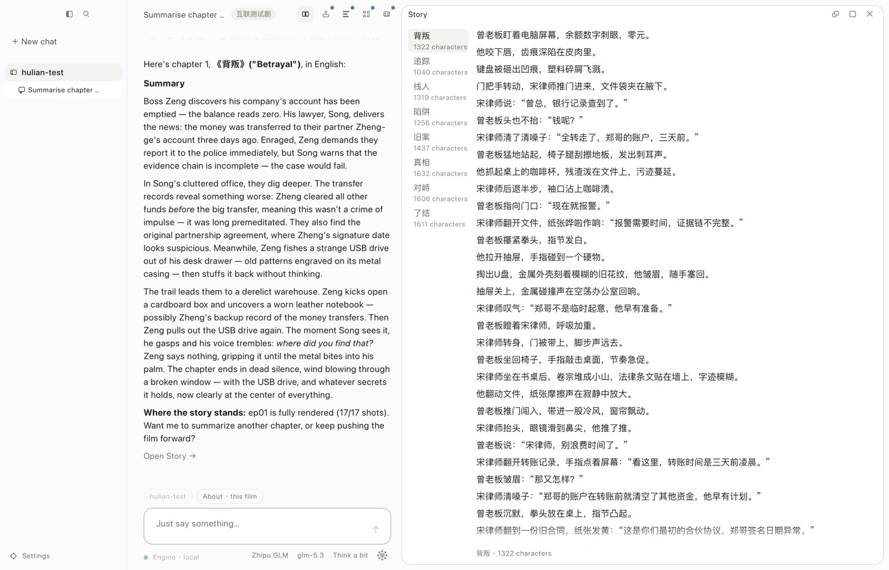
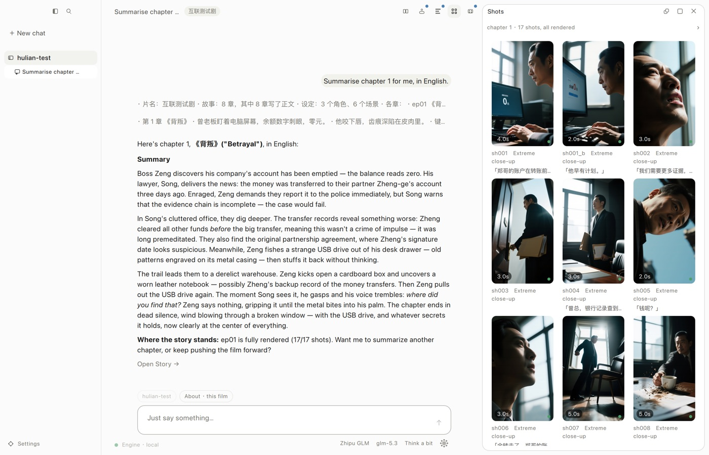
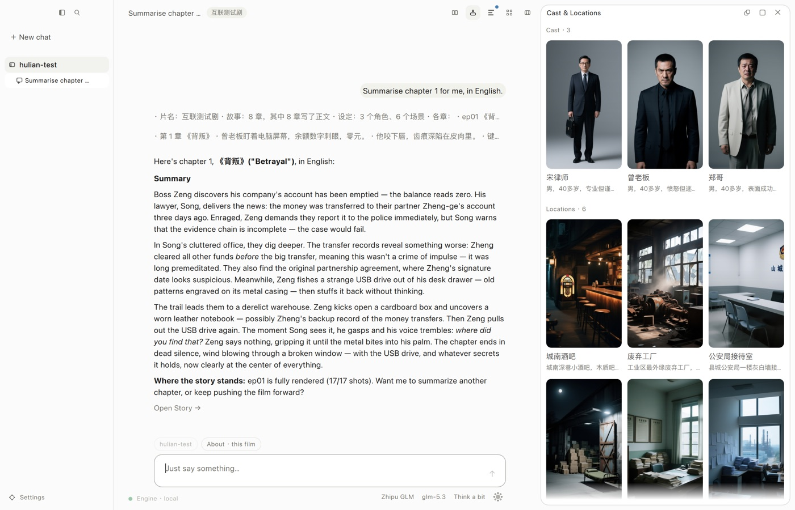
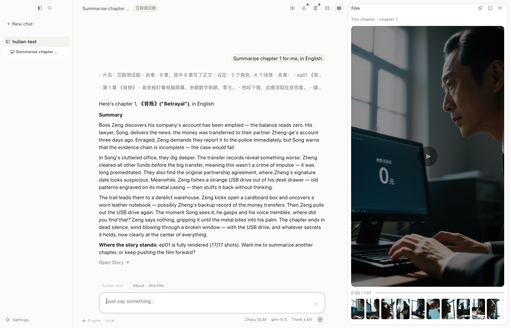
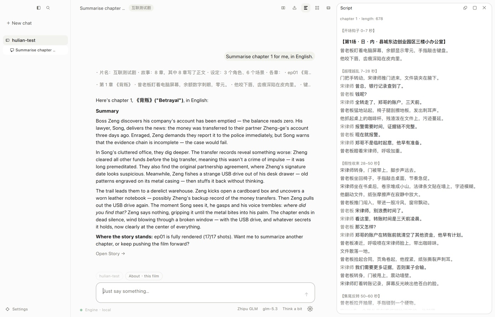

# changji · 场记

**English** · [简体中文](README.zh-CN.md)

**Say what film you want. It writes the chapters, breaks them into shots, draws
every first frame, renders the video, speaks the lines, and cuts the result into
one film — on your own machine, out of one binary.**

changji is not a generative model. It is the production line that drives a pile
of them: the shot table, the asset library, the scheduling, the quality gates,
the final cut. The name is the Chinese for *script supervisor* — the person on a
crew who keeps the shot list, watches continuity between takes, and records the
state of every setup. That is the job this software does.



**One binary.** Interface, HTTP API, orchestration, image generation, video
generation, speech and the language model all live in one process. There is no
second service to start, no Python environment, no ComfyUI, no queue broker.
The web UI is compiled into the executable; the desktop app is the same engine
with a Qt shell around it.

---

## Getting it running

### 1. Install

```bash
curl -fsSL https://raw.githubusercontent.com/changji-ai/ChangJi/main/install.sh | bash
```

Or take a package from [Releases](https://github.com/changji-ai/ChangJi/releases).
Windows / macOS / Linux, x64 and arm64, named like `changji-linux-arm64.tar.gz`,
plus `-cuda` and `-vulkan` builds for machines with a GPU. The macOS binaries
are signed with a Developer ID and notarised.

The desktop app is published under the `desktop-v*` tags of the same
repository: a signed `.dmg` on macOS, an installer on Windows, a tarball on
Linux.

### 2. Check the machine

```bash
changji --doctor
```

It reports the card it found, where the weights live, the language model and
the speech backend, the project directory, the CJK fonts, the output canvas —
and, at the end, what this machine can actually produce right now. It exits
non-zero when something has to be fixed, so it tells you what is missing
instead of failing three hours into a render.

### 3. Start it

```bash
changji --port 8080      # then open http://127.0.0.1:8080
```

…or open the desktop app, which starts the same engine inside itself. Either
way the first page is a setup page.

### 4. Point it at models

The engine measures the VRAM it has and offers weights that fit: a first-frame
image model, a video model, a speech model, and the text encoder and VAE they
share. They are GGUF files, downloaded from the setup page in the quantisation
that fits the card — not bundled here.

The language model is separate, and has three modes:

- **`backend = "remote"`** — any OpenAI-compatible endpoint. This is the usual
  choice: a machine with no GPU at all can still write the story, the script
  and the storyboard.
- **`backend = "local"`** — llama.cpp in-process, no server to run. It shares
  the VRAM scheduler with image and video generation, and steps aside when a
  render needs the card.
- **`backend = "command"`** — shell out to a CLI on this machine that answers
  on stdout.

Speech works the same way: in-process, or an HTTP service you already run.

### 5. Say what you want

The desktop app is one conversation and one canvas. You talk; the canvas shows
what changed. The canvas has five panes — Story, Cast & Locations, Script,
Shots, Film — and each is editable: fix a line of dialogue, swap a character's
reference image, re-shoot one shot.

The conversation is an agent with tools on the engine side, so "write the first
three chapters", "which shots still have no first frame", "re-render sh004" and
"join what's done into a film" are all just things you say. The tools it can
reach are the same operations the buttons call: `project_state`,
`create_project`, `story_outline`, `story_write_chapters`, `assets_understand`,
`refs_make`, `script_write_all`, `storyboard_plan_all`, `render_run`,
`film_join`, `shot_edit`, `task_cancel`, and the read-only ones next to them.

**Long jobs live in the engine, not in the page.** Close the window, come back
an hour later, and the queue, the progress and the cancel button are all still
there. The one-click path — outline → chapter → understanding → storyboard →
reference images → the first *n* minutes of film — is a chain in the engine for
exactly this reason.

---

## What it does differently

### The shot table is the hub



Every stage reads and writes one structured shot table. No stage hands free
text to the next one. A shot carries its characters, its location, its camera
move, its shot size, its line of dialogue, its planned duration and its real
duration — so "which shots in chapter 3 have a first frame but no audio" is a
query, not an archaeology dig through filenames.

### Appearance is assembled by code, not written by the model



The storyboard schema has **no field** for a face, a hairstyle or an outfit.
The model can only name a character id and what changes in this shot. The
appearance sentence is concatenated by the program out of the asset library,
byte for byte the same in every shot the character appears in.

> That holds because *the field does not exist* and *the sentence is assembled
> in code* — not because of grammar-constrained sampling. Since 2026-09-14
> structure is carried by the prompt: the JSON Schema is pasted into it as
> text, no GBNF, no `response_format` (see `src/llm/client.cpp`). For the
> model, `enum`, `required` and `minItems` are advice. What is hard is the
> missing field.

### Voice first, then timing

Speech is generated before the shot durations are locked. The real length of a
spoken line sets the length of the shot, and a line that will not fit splits
the shot in two. Picture and sound are aligned at the source instead of being
stretched into agreement at the end.

### Quality gates, and a degraded take beats a stopped line

Every rendered shot is inspected: a near-solid or blown-out frame, a hard cut in
the middle of a take, a duration that does not match the plan, a shot too short
to hold its own line of dialogue; the finished chapter is checked for loudness,
true peak and a missing track. A failure that a new seed might fix is retried, a
failure that it cannot is sent back a stage, and past the retry limit the last
take is kept and marked degraded — stopping to ask a human, halfway through an
unattended night, means losing the whole chapter.

Each verdict carries the number it was made on. "The picture is nearly a solid
colour" is not enough to act on; whether the spread was 3 or 7.9 is what tells
you it was the model and not the threshold.

Rejected chapter text is **revised, not re-rolled**: the failing checks are
collected into one list and handed back with the draft, and the model edits
only those places.

### One film, one file



A chapter is as long as its content needs; it is not padded to fit a slot. When
the chapters are shot, they are joined in order into one film. Chapters with no
footage are skipped rather than blocking the rest, and the page says which ones
were skipped.

There is also a "first *n* minutes" path that picks just enough shots to fill
*n* minutes and assembles them into `output/preview/`, which is how you see
whether the look is right before committing a night of GPU time.

### Everything sent to a model is on disk

Every call writes its prompt, its tool list and its reply under
`<data dir>/llm_log/<project>/`, with an index. When a chapter comes out wrong,
the question "what did it actually see" has an answer you can `diff`.

### More than one GPU, more than one machine

One machine runs one `changji` process, which starts one worker per GPU by
itself. Other machines are listed as peers in the configuration; the scheduler
opens as many slots on each as it reports. Rendering a chapter across a desk
full of cards needs no extra daemon.

### Twelve languages

The interface and the engine's own messages are translated into eleven
languages on top of the Chinese source: Arabic, German, English, Spanish,
French, Hindi, Japanese, Korean, Brazilian Portuguese, Russian and traditional
Chinese.

---

## How a chapter gets made



| Stage | In | Out |
|---|---|---|
| `story_outline` | a premise, or a topic pulled off the web | the whole story: chapters, loglines, the arc |
| `chapter_write` | one chapter's outline plus what came before | the chapter's prose, gated and revised |
| `story_understand` | the prose | characters, locations, what has to stay consistent |
| `bible` | the cast | the appearance sentences the asset library will hand out |
| `ref_images` | the cast and locations | reference stills, three angles per character |
| `script_story` | the prose | a screenplay: beats, scene headings, dialogue |
| `storyboard` | the screenplay | the shot table: shot size, camera move, duration, line |
| `audio` | the lines | spoken audio, and the real durations that lock the shots |
| `frames` | the shot table plus the reference images | one first frame per shot |
| `render` | first frame plus the shot | the shot's video |
| gates | each rendered shot | pass, retry with a new seed, or keep and mark degraded |
| `assemble` | the shots that are usable | the chapter's film, subtitles, optional music |
| `film_join` | the chapters that have film | one film, one file |

Reading the web is a stage too: there are tools for trending topics, search and
fetching a page, and a path that turns what it found into the chapter in front
of you.

---

## Driving it from outside the UI

### Command line

```bash
changji --version              # which build this is
changji --doctor               # health check; non-zero exit means fix something
changji --init-config          # write an annotated configuration template
changji --port 8080            # serve on localhost
changji --host 0.0.0.0 --port 8080   # serve to the LAN
changji --worker --gpu 1       # a worker process for one card (started for you)
```

In-process speech, from a build with `CHANGJI_LLAMA=ON`:

```bash
changji --say "He did not look back, there on the rooftop in the rain."
changji --say "a test line" --tts-model talker.gguf --tts-decoder tok.gguf
```

`--say` is the on-the-metal test for speech: **no server, no project, no
ffmpeg** — one line answers whether sound comes out.

### HTTP

The same API the UI uses is open on the port you served: projects, chapters,
the shot table, assets, media, runs, configuration, and a job stream to follow
what is happening. `src/http/` is the whole route table.

### Configuration

Precedence: environment variables > the project's `changji.toml` > the user's
global configuration > built-in defaults. Machine settings and film settings
are deliberately kept in different files — a machine's VRAM has nothing to do
with a film's aspect ratio.

Every environment variable is prefixed `CHANGJI_`: `LLM_BASE_URL`, `LLM_MODEL`,
`LLM_API_KEY`, `TTS_BASE_URL`, `TTS_BACKEND`, `WORKSPACE`, `VRAM_GB`,
`FFMPEG_PATH`, and the `MODELS_*` family that points at individual weight files
(`MODELS_DIR`, `MODELS_LLM`, `MODELS_IMAGE`, `MODELS_VIDEO`, `MODELS_TTS`,
`MODELS_TTS_DECODER`, the VAEs and text encoders next to them). Adding one means
writing it **in two places** — the `env_mapping()` table and `apply_env()` —
and missing the second is not an error, so `test_models_config.cpp` has a test
whose whole job is to catch it.

---

## Building it

Needs CMake ≥ 3.20 and a C++17 compiler. On Linux and macOS, cmake, ninja and
git are enough.

```bash
cmake -S . -B build -G Ninja -DCMAKE_BUILD_TYPE=Release
cmake --build build
```

**`CHANGJI_LLAMA` also needs a Python interpreter** — llama.cpp is patched in
place with leejet's extensions after it is fetched, and configure stops dead if
it cannot find one. That is a build-time dependency only.

**`CHANGJI_SSL` (ON by default) needs OpenSSL ≥ 3.0, and only accepts static
libraries.** httplib uses it for https. Refusing shared libraries has a history:
a package that linked the build machine's `libssl.3.dylib` ran perfectly on the
build machine, and on somebody else's it was
`dyld: Library not loaded: /opt/homebrew/opt/openssl@3/...`.

- Linux: `apt install libssl-dev` (it carries `libssl.a`)
- macOS: `brew install openssl@3`, then
  `-DOPENSSL_ROOT_DIR=$(brew --prefix openssl@3)`
- If no static library is found it **stops there**; it never quietly falls back
  to dynamic linking
- Just want a fast local build with no https: `-DCHANGJI_SSL=OFF`

The released packages depend on nothing installed on any particular machine: the
`openssl` job in `.github/workflows/openssl.yml` builds a pinned static copy
itself (cached) and points `-DOPENSSL_ROOT_DIR` at it. In the same
CMakeLists, brotli and zlib are fetched and built statically, so there is
nothing to install for those either.

Windows needs **MSVC 2022 Build Tools + Ninja**. Enter the MSVC environment
first:

```powershell
cmd /c '"C:\Program Files (x86)\Microsoft Visual Studio\2022\BuildTools\VC\Auxiliary\Build\vcvars64.bat" && set' |
  ForEach-Object { if ($_ -match '^([^=]+)=(.*)$') { Set-Item -Path ("env:" + $matches[1]) -Value $matches[2] } }
```

> Skipping that step shows up as `fatal error C1083: cannot open include file:
> "algorithm"`. That is not a code problem; `INCLUDE` is simply not set.

### Build options

| Option | Default | What it does |
|---|---|---|
| `CHANGJI_SD` | ON | Link stable-diffusion.cpp; images and video in-process |
| `CHANGJI_SD_CUDA` | OFF | CUDA GPU backend (NVIDIA). Needs the CUDA Toolkit, and MSBuild looks for the **versioned** `CUDA_PATH_V13_2` rather than `CUDA_PATH` — both have to be in the process environment |
| `CHANGJI_SD_HIP` | OFF | HIP / ROCm GPU backend (AMD). Needs ROCm ≥ 6.1 (Linux) or the AMD HIP SDK (Windows). The machine that runs it needs the ROCm runtime too |
| `CHANGJI_SD_SYCL` | OFF | SYCL GPU backend (Intel). Needs oneAPI's `icx`/`icpx`. **The result is not a single file**; the machine that runs it needs the oneAPI runtime |
| `CHANGJI_SD_VULKAN` | OFF | Vulkan GPU backend, **works on NVIDIA, AMD and Intel alike**. Building needs the Vulkan SDK (`glslc`); running needs only the Vulkan runtime that ships with the driver. This is the road to "download, unpack, run" on AMD and Intel |
| `CHANGJI_CUDA_ARCH` | `89` | Which NVIDIA architectures to build for, semicolon separated. The list the release packages use is in release.yml |
| `CHANGJI_CUDA_STATIC` | OFF | Link the CUDA runtime (cudart / cuBLAS / cuBLASLt) into the binary, so **the result is a single executable**. This is the shape the release packages take; CI's linux-x64-cuda cell has it on. ⚠️ **Only possible on Linux**: NVIDIA does not ship a static cuBLAS for Windows, so that package is necessarily an exe plus two DLLs |
| `CHANGJI_HIP_ARCH` | `gfx1030;gfx1100;gfx1101;gfx1102` | Which AMD architectures to build for. **A card outside the list simply will not run** — HIP has no PTX-style fallback the way CUDA does |
| `CHANGJI_LLAMA` | OFF | Link llama.cpp + mtmd for **in-process speech and an in-process LLM**. Turning it on adds a llama.cpp and a patched ggml to a clean build |
| `CHANGJI_SSL` | ON | Statically link OpenSSL, without which httplib cannot speak https. **Static libraries only**; see above |
| `CHANGJI_BUILD_TESTS` | ON | Build `changji_tests` |
| `CHANGJI_STATIC_RUNTIME` | ON | Statically link the runtime. "No runtime dependencies" is half the reason this backend exists. **Ignored on macOS** — Apple's toolchain has no static libc++ |
| `CHANGJI_DESKTOP` | OFF | Build the Qt desktop shell. Its sources are in the product repository, so this needs both checked out |
| `CHANGJI_VERSION` | `dev` | The version baked into the binary, printed by `--version`. CI fills it in from the git tag |

The four GPU backends are **mutually exclusive**; turning on two stops
configuration. Which to pick:

| Card | First choice | Alternative |
|---|---|---|
| NVIDIA | `CHANGJI_SD_CUDA` | `CHANGJI_SD_VULKAN` |
| AMD | `CHANGJI_SD_VULKAN` (runs as-is) | `CHANGJI_SD_HIP` (faster, but ROCm has to be installed) |
| Intel | `CHANGJI_SD_VULKAN` | `CHANGJI_SD_SYCL` (needs the oneAPI runtime) |

> Vulkan is the first choice for AMD and Intel not because it is fast, but
> because the other two produce artifacts dragging a pile of runtime
> dependencies behind them — and because leejet's ggml extension patches
> **do not cover ggml-sycl** (they cover CPU / CUDA / Metal / Vulkan; see
> [patches/README.md](patches/README.md)), so fp8 weights most likely will not
> load under SYCL.

With `CHANGJI_LLAMA` on, ggml comes from llama.cpp and is **patched in place
with leejet's extensions** (`patches/apply_to_llamacpp.py`, hooked onto
FetchContent's `PATCH_COMMAND`, idempotent). sd.cpp depends on those extensions
outright — FP8 types, int8 convrot, i8 tensorwise matmul — with no `#ifdef`
guarding the call sites. The whole story is in
[verify/RESULTS.md](verify/RESULTS.md) and [patches/README.md](patches/README.md).

Two build directories side by side is normal: `build/` (default) and
`build_llama/` (`-DCHANGJI_LLAMA=ON`).

---

## Inside

### Source layout

```
src/
├── main.cpp        the command line (--doctor / --init-config / --say / serve / --worker)
├── util/           paths, subprocesses, text, time, East Asian widths
├── config/         configuration structs, TOML, environment overrides, validation
├── models/         project / character / shot, and reading and writing the project library
├── http/           the route table and the API (read, edit, upload, media, chat, run, one-click)
├── llm/            an OpenAI-compatible client, tool calls, and the call log
├── agent/          the conversation loop and the tools it can reach
├── stages/         outline, chapter, understanding, screenplay, storyboard, reference
│                   images, first frames, render, speech, music, web tools
├── infer/          the sd.cpp façade, VRAM scheduling, the worker pool, the per-GPU
│                   worker farm, the peer registry
├── lan/            finding other changji machines on the LAN (mDNS)
├── net/            the protocol half of a WebSocket client
├── setup/          the first-run page: model catalogue, download sources, downloader
├── media/          ffmpeg, subtitles, assembly
├── gates/          quality gates
├── pipeline/       the job table, the task board, the whole-chapter pipeline, the
│                   preview cut, the film join
└── doctor/         the environment health check

prompts.toml        **every prompt**, for the language model and for image generation.
                    Generated into the binary at build time; edit prompts here
tests/unit/         doctest unit tests
tests/golden/       a frozen JSON corpus the tests read
tools/              code generation (prompts, web UI, East Asian widths), a fake LLM,
                    and the GPU-rental tool
patches/            the leejet/ggml extension patches and the script that applies them
verify/             the up-front verification project (one-off; conclusions in RESULTS.md)
i18n/               translation tables, baked into the binary
docs/screenshots/   the pictures in the two READMEs (en/ and zh/)
```

### What is in this repository, and what is not

This repository holds the engine, the bundled web UI (as a generated header)
and the whole release line. The web UI's Vue sources, the Qt desktop shell, the
brand assets and the design documents live in the private product repository —
which is why `CHANGJI_DESKTOP=ON` needs both checked out, and why every CI
pipeline checks the product repository out as `changji/` and lays this one over
`changji/cpp`.

### Testing

```bash
./build/changji_tests            # the unit tests
ctest --test-dir build           # the same thing, through ctest
```

**A corpus that cannot be read counts as a failure, not a skip.** A skipped test
and a passing test look identical in the total, but the first guarantees
nothing — point `CHANGJI_GOLDEN_DIR` somewhere wrong and every corpus-reading
test silently verifies nothing at all.

The prompts and schemas are guarded by **structural** tests, not by byte-for-byte
snapshots: whether a field is still there, whether anything fell out of
`required`, whether a column nobody reads crept back in, and a budget line on
how many characters the storyboard schema is allowed to add to the prompt.
Changing the wording of a description should not turn a test red; deleting a
field should.

### Packaging

`.github/workflows/` holds the whole release line, and it is the only copy.

| | |
|---|---|
| `release.yml` | The engine: six CPU platforms, four GPU cells, macOS signing and notarisation, publish |
| `desktop.yml` | The desktop app: three platforms, packaged, signed, notarised, and **actually opened** before publishing |
| `webapp.yml` | Build the web UI and bake it into a header (`workflow_call`; both lines use it) |
| `openssl.yml` | The pinned static OpenSSL (`workflow_call`; both lines use it) |

`install.sh` at the repository root is the installer that one-liner runs; it
downloads from this repository's Releases.

Packaging needs a `CHANGJI_PRODUCT_TOKEN` secret to reach the product
repository. `tools/setup_signing_secrets.sh` sets it together with the five
macOS signing secrets, verifying each one locally before it uploads anything.

### Where this stands

Chapters have been written, storyboarded, voiced, rendered and joined into
films on real hardware; the desktop shell, the multi-GPU farm and the
cross-machine scheduler are all in use. The rough edges that are known and not
hidden:

| | |
|---|---|
| Consistency across shots | Reference images plus assembled appearance text hold a character together far better than prompting alone, but they do not make it certain |
| macOS / arm64 | CI builds it and the desktop app runs there; a full chapter has not been rendered on Apple silicon |
| Model choice moves | The catalogue tracks what is worth running today, and today changes |

---

## License

Apache-2.0 — see [LICENSE](LICENSE) and [NOTICE](NOTICE).

Third-party components are fetched at build time under their own licenses, and
ffmpeg is called as an external program rather than linked in. **The generative
models are not part of this software and are not covered by this license**:
each has its own terms, and some forbid commercial use. Check the weights you
download before you sell what comes out of them.
