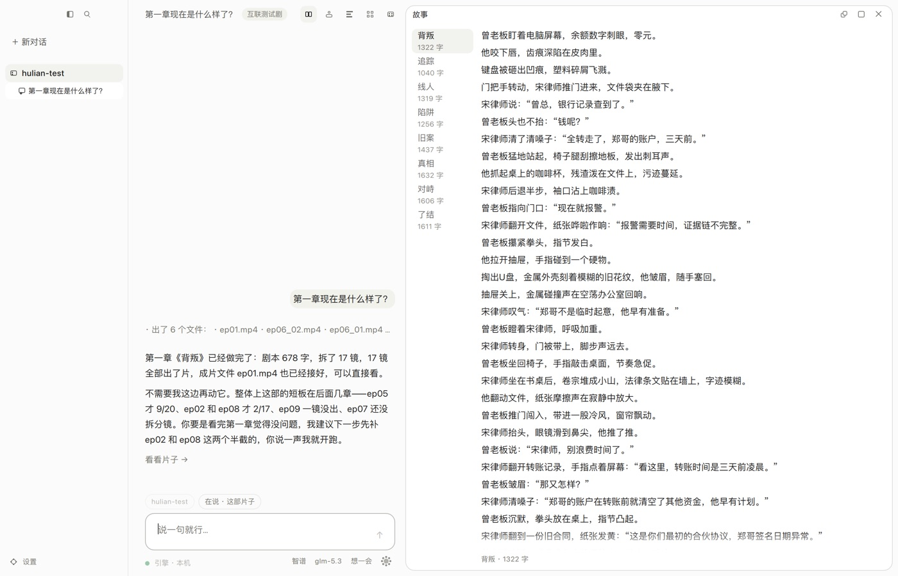
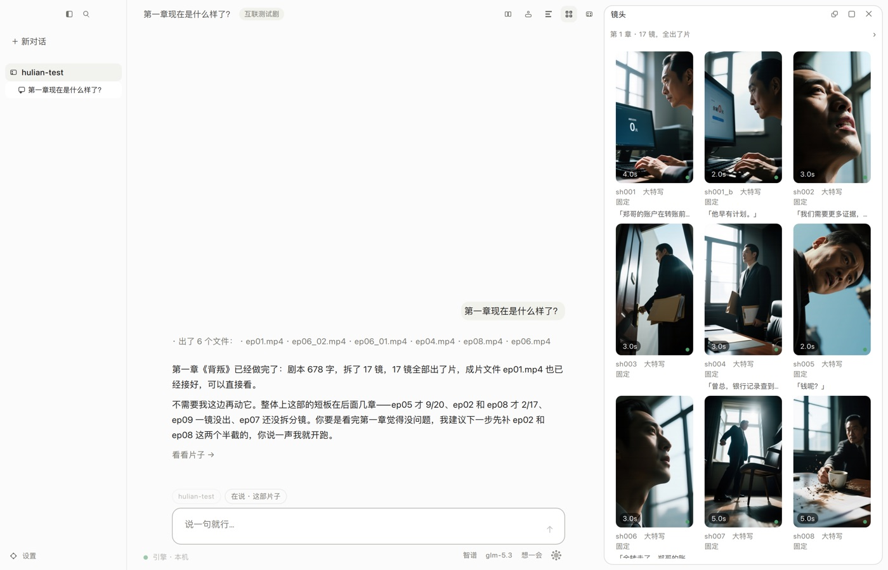
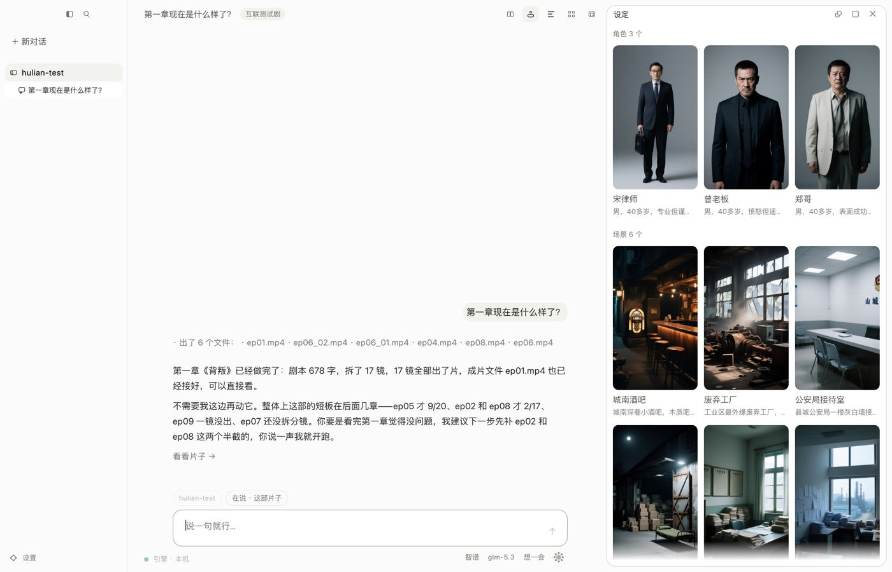
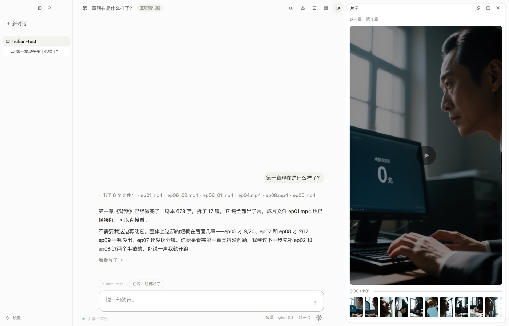
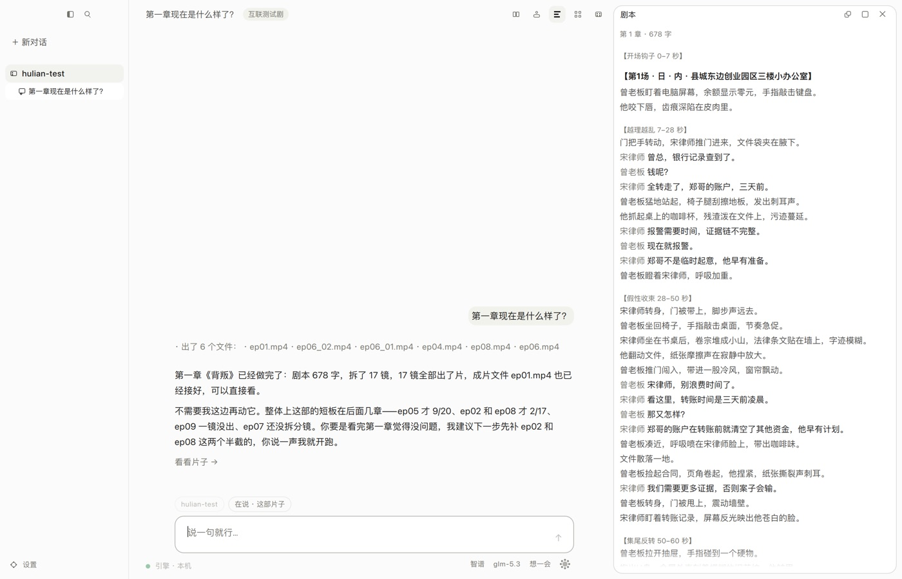

# 场记 changji

[English](README.md) · **简体中文**

**说一句你想拍什么。它写章、拆镜、出首帧、出片、配音，最后接成一部完整的
电影——在你自己的机器上，一个二进制。**

场记不是生成模型，是把一堆生成模型串成生产线的那一层：分镜表、资产库、排队
调度、质量闸门、最后的装配。名字取自影视工作里的「场记」——维护分镜表、盯住
跨镜头的连续性、记录每一条的状态，这个岗位负责的正是这套软件要做的事。



**一个二进制。** 界面、接口、编排、出图、出片、配音、大模型全在一个进程里。
没有第二个服务要起，没有 Python 环境，没有 ComfyUI，没有队列中间件。网页界面
编进了可执行文件里；桌面端是同一个引擎套一层 Qt 壳。

---

## 装上，跑起来

### 一、装

```bash
curl -fsSL https://raw.githubusercontent.com/changji-ai/ChangJi/main/install.sh | bash
```

或者直接从 [Releases](https://github.com/changji-ai/ChangJi/releases) 拿一个包。
Windows / macOS / Linux，x64 和 arm64，名字长这样：
`changji-linux-arm64.tar.gz`，有显卡的另有 `-cuda` 和 `-vulkan` 两档。macOS
那几个包是用 Developer ID 签过名、过了公证的。

桌面端发在同一个仓库的 `desktop-v*` 标签下：macOS 是签过名的 `.dmg`，Windows
是安装器，Linux 是一个压缩包。

### 二、先体检

```bash
changji --doctor
```

它报的是：认到哪张卡、权重放在哪、大模型和配音各配的什么、项目目录在哪、
中文字体有没有、出片画布多大——末了还有一句「这台机器现在能产出什么」。
有要修的它退非零码。**问题在这儿说清，好过三小时后死在出片中途。**

### 三、起服务

```bash
changji --port 8080      # 浏览器打开 http://127.0.0.1:8080 就是界面
```

或者直接开桌面端，它自己在进程里起同一个引擎。两条路第一页都是初装页。

### 四、指到模型上

引擎量一下这台机器的显存，按装得下的挑给你：首帧的图像模型、出片的视频模型、
配音模型，以及它们共用的文本编码器和 VAE。都是 GGUF，从初装页下，**不在这个
仓库里**。

大模型是另一回事，三种跑法：

- **`backend = "remote"`** —— 任何兼容 OpenAI 接口的服务。最常走的一条：
  一台没有显卡的机器照样能写故事、写剧本、拆分镜。
- **`backend = "local"`** —— llama.cpp 在进程内跑，不用另起 llama-server。
  它归显存调度器管：出片要显存时它让开。
- **`backend = "command"`** —— 调本机一个命令行程序，从标准输出收答案。

配音同理：进程内跑，或者指到你已经起着的一个 HTTP 服务上。

### 五、说一句你想拍什么

桌面端是**一条对话加一块画布**。你说话，画布上跟着变。画布有五格——故事、
设定、剧本、镜头、片子——每一格都能直接改：改一句对白、换一张角色
参考图、单独重拍某一镜。

对话那头是带工具的 agent，工具跑在引擎里。所以「把前三章写了」「哪几镜还
没有首帧」「sh004 重出一遍」「出了片的接起来」这些话说出来就是在干活。它
能碰的工具和按钮调的是同一批：`project_state`、`create_project`、
`story_outline`、`story_write_chapters`、`assets_understand`、`refs_make`、
`script_write_all`、`storyboard_plan_all`、`render_run`、`film_join`、
`shot_edit`、`task_cancel`，外加旁边那几个只读的。

**长活登记在引擎里，不在页面里。** 关掉窗口，一小时后回来，排队、进度和那颗
停止按钮都还在。「一键成片」那条链——大纲 → 正文 → 理解 → 分镜 → 参考图 →
前 n 分钟——整条也在引擎里，就是为了这个。

---

## 它跟别的不一样在哪

### 分镜表是中枢



所有阶段读写同一份结构化的分镜表，**阶段之间不传自由文本**。一镜带着它的
角色、场景、运镜、景别、台词、计划时长和真实时长——所以「第三章哪几镜有首帧
但还没配音」是一次查询，不是拿文件名考古。

### 角色外观由程序拼，不由模型写



分镜表的 schema 里**没有任何字段**能写长相、发型、服装。模型只能填角色 id 和
本镜的可变项；那句外观描述由程序从资产库机械拼接，同一个角色在每一镜里逐字节
相同。

> 靠得住的是「**那个字段不存在**」和「**这段字是程序拼的**」，不是语法采样
> 兜底：2026-09-14 起结构约束整个交给提示词，schema 以文字贴在提示词后面发，
> 没有 GBNF，也不发 `response_format`（见 `src/llm/client.cpp`）。对模型来说
> `enum` / `required` / `minItems` 都**只是建议**，硬的只有那个缺掉的字段。

### 配音先行

先跑配音拿到真实时长，再反推锁定镜头时长：一句两秒的台词把计划五秒的镜头收
到两秒，装不下台词的镜头直接拆成两镜。音画在源头对齐，而不是最后硬拉到一起。

### 质量闸门：降级的一镜好过停住的一整章

每一镜出片后都要过一遍：画面近乎纯色、过暗过曝、片中硬切、时长和计划对不上、
镜头短得装不下自己那句台词；整章装配完再查响度、真峰值和有没有音轨。换个种子
可能就好的判重试，重跑也没用的退回上一阶段，重试超限就留下最后一版并标成降级
——**无人值守跑一整夜，停下来等人等于整章废掉**。

每一条判定都带着它凭的那个数。「画面近乎纯色」本身不够用，展布是 3 还是 7.9
才分得出是模型的问题还是阈值太严。

正文被打回是**改稿，不是重掷**：没过的几条攒成一张清单，连着上一稿一起回给
模型，只改那几处。

### 成片是一部完整的电影，一个文件



一章的长短是内容的结果，不是反过来让内容去凑长度。出了片的章按章序接成一部
电影。没片的那几章跳过，不拦着别的章，跳了哪几章在页面上说清。

另有一条「只做前 n 分钟」：挑出够 n 分钟的那几镜做出来，装进
`output/preview/`。在押上一整夜显卡之前，先看看这个调子对不对。

### 发给模型的每一个字都落盘

每次调用把提示词、工具表和回复写在 `<数据目录>/llm_log/<项目>/` 下，另有索引。
一章写坏了的时候，「它当时到底看见了什么」是一个能 `diff` 出来的答案。

### 多卡，多机

一台机器跑一个 `changji` 进程，它自己按显卡数拉起工作子进程。别的机器写在
配置里的机器表上，调度那头按每台报的槽数开路。一屋子显卡一起渲一章，不用另外
装守护进程。

### 十二种语言

界面和引擎自己说的话，在中文之上另有十一种翻译：阿拉伯语、德语、英语、西班牙
语、法语、印地语、日语、韩语、巴西葡萄牙语、俄语、繁体中文。

---

## 一章是怎么跑出来的



| 阶段 | 吃什么 | 吐什么 |
|---|---|---|
| `story_outline` | 一句前提，或者从网上捞的一个题材 | 整个故事：分几章、每章的梗概、整条弧线 |
| `chapter_write` | 这一章的梗概加前面发生过什么 | 这一章的正文，过闸门、必要时改稿 |
| `story_understand` | 正文 | 有哪些角色、哪些场景、什么必须保持一致 |
| `bible` | 角色表 | 资产库往外发的那几句外观描述 |
| `ref_images` | 角色和场景 | 参考图，每个角色三个角度 |
| `script_story` | 正文 | 剧本：拍子、场景头、对白 |
| `storyboard` | 剧本 | 分镜表：景别、运镜、时长、台词 |
| `audio` | 台词 | 配音，以及锁死镜头时长的那个真实秒数 |
| `frames` | 分镜表加参考图 | 每一镜一张首帧 |
| `render` | 首帧加这一镜 | 这一镜的视频 |
| 闸门 | 每一镜的成片 | 过、换种子重试、或者留下并标降级 |
| `assemble` | 能用的那几镜 | 这一章的片子、字幕、可选的配乐 |
| `film_join` | 出了片的那几章 | 一部电影，一个文件 |

上网也是一个阶段：热榜、搜索、读网页三个工具摆在模型面前，另有一条路把捞回来
的东西直接写成眼前这一章。

---

## 界面之外

### 命令行

```bash
changji --version              # 这是哪一版
changji --doctor               # 体检，退非零码就是有要修的
changji --init-config          # 写一份带注释的配置模板
changji --port 8080            # 只在本机上服务
changji --host 0.0.0.0 --port 8080   # 开给局域网
changji --worker --gpu 1       # 单卡工作进程（平时它自己拉，不用你起）
```

进程内配音（要 `CHANGJI_LLAMA=ON` 编出来的二进制）：

```bash
changji --say "他没有回头，雨落在天台上。"
changji --say "试一句" --tts-model talker.gguf --tts-decoder tok.gguf
```

`--say` 是配音那一层贴着铁跑的试音：**不起服务、不要项目、不碰 ffmpeg**——
一句话就回答「有没有声音出来」。

### HTTP

界面用的那套接口就开在你起的端口上：项目、章、分镜表、资产、媒体、跑批、
配置，外加一条推进度的流。`src/http/` 就是整张路由表。

### 配置

优先级：环境变量 > 项目目录下的 `changji.toml` > 用户全局配置 > 内置默认值。
**机器的设置和这部电影的设置分两处**——一台机器有多少显存，和一部片子什么画幅，
本来就是两件事。

环境变量一律以 `CHANGJI_` 打头：`LLM_BASE_URL`、`LLM_MODEL`、`LLM_API_KEY`、
`TTS_BASE_URL`、`TTS_BACKEND`、`WORKSPACE`、`VRAM_GB`、`FFMPEG_PATH`，外加指到
具体权重文件的 `MODELS_*` 那一族（`MODELS_DIR`、`MODELS_LLM`、`MODELS_IMAGE`、
`MODELS_VIDEO`、`MODELS_TTS`、`MODELS_TTS_DECODER`，以及旁边那几个 VAE 和文本
编码器）。加一个要**写在两处**——`env_mapping()` 那张表和 `apply_env()`——
漏掉第二处不会报错，所以 `test_models_config.cpp` 有一条用例专门抓它。

---

## 自己编

要 CMake ≥ 3.20 和一个 C++17 编译器。Linux 和 macOS 上，cmake、ninja、git
三样就够。

```bash
cmake -S . -B build -G Ninja -DCMAKE_BUILD_TYPE=Release
cmake --build build
```

**`CHANGJI_LLAMA` 另外要一个 Python 解释器**——llama.cpp 拉下来之后要就地打上
leejet 那套扩展补丁，找不到解释器当场停在配置阶段。这只是编译期的依赖。

**`CHANGJI_SSL`（默认开）要 OpenSSL ≥ 3.0，而且只认静态库。** httplib 靠它发
https。不收动态库是有来历的：有个包链上了构建机自己的 `libssl.3.dylib`，在构建
机上跑得好好的，换一台就是
`dyld: Library not loaded: /opt/homebrew/opt/openssl@3/...`。

- Linux：`apt install libssl-dev`（带 `libssl.a`）
- macOS：`brew install openssl@3`，然后
  `-DOPENSSL_ROOT_DIR=$(brew --prefix openssl@3)`
- 找不到静态库就**停在那儿**，绝不会悄悄退回动态链接
- 只想本机快编一版、不要 https：`-DCHANGJI_SSL=OFF`

发布包不依赖任何机器上装了什么：`.github/workflows/openssl.yml` 那个 job 自己
编一份钉死版本的静态 OpenSSL（带缓存），再把 `-DOPENSSL_ROOT_DIR` 指过去。同一
份 CMakeLists 里 brotli 和 zlib 也是拉下来静态编的，一样什么都不用装。

Windows 要 **MSVC 2022 Build Tools + Ninja**，先进 MSVC 环境：

```powershell
cmd /c '"C:\Program Files (x86)\Microsoft Visual Studio\2022\BuildTools\VC\Auxiliary\Build\vcvars64.bat" && set' |
  ForEach-Object { if ($_ -match '^([^=]+)=(.*)$') { Set-Item -Path ("env:" + $matches[1]) -Value $matches[2] } }
```

> 跳过这一步的表现是 `fatal error C1083: cannot open include file:
> "algorithm"`。那不是代码问题，是 `INCLUDE` 根本没设。

### 编译选项

| 选项 | 默认 | 干什么 |
|---|---|---|
| `CHANGJI_SD` | ON | 链接 stable-diffusion.cpp，出图出片都在进程内 |
| `CHANGJI_SD_CUDA` | OFF | CUDA 后端（NVIDIA）。要 CUDA Toolkit；MSBuild 找的是**带版本号的** `CUDA_PATH_V13_2` 而不是 `CUDA_PATH`，两个都得在进程环境里 |
| `CHANGJI_SD_HIP` | OFF | HIP / ROCm 后端（AMD）。要 ROCm ≥ 6.1（Linux）或 AMD HIP SDK（Windows）。跑它的机器也要装 ROCm 运行时 |
| `CHANGJI_SD_SYCL` | OFF | SYCL 后端（Intel）。要 oneAPI 的 `icx`/`icpx`。**产物不是单文件**，跑它的机器要装 oneAPI 运行时 |
| `CHANGJI_SD_VULKAN` | OFF | Vulkan 后端，**N 卡 A 卡 I 卡通吃**。编要 Vulkan SDK（`glslc`），跑只要驱动自带的 Vulkan 运行时。这是 AMD 和 Intel 上「下载、解压、跑」那条路 |
| `CHANGJI_CUDA_ARCH` | `89` | 给哪些 NVIDIA 架构编，分号隔开。发布包用的那张单子在 release.yml 里 |
| `CHANGJI_CUDA_STATIC` | OFF | 把 CUDA 运行时（cudart / cuBLAS / cuBLASLt）静态链进去，**产物是单个可执行文件**。发布包就是这个形状，CI 的 linux-x64-cuda 那一格开着它。⚠️ **只有 Linux 做得到**：NVIDIA 不给 Windows 发静态 cuBLAS，那个包只能是一个 exe 加两个 DLL |
| `CHANGJI_HIP_ARCH` | `gfx1030;gfx1100;gfx1101;gfx1102` | 给哪些 AMD 架构编。**不在单子上的卡直接跑不起来**——HIP 没有 CUDA 那种 PTX 兜底 |
| `CHANGJI_LLAMA` | OFF | 链接 llama.cpp + mtmd，**进程内配音和进程内大模型**靠它。开了之后干净构建会多一份 llama.cpp 和一份打过补丁的 ggml |
| `CHANGJI_SSL` | ON | 静态链接 OpenSSL，不然 httplib 发不了 https。**只收静态库**，见上 |
| `CHANGJI_BUILD_TESTS` | ON | 编 `changji_tests` |
| `CHANGJI_STATIC_RUNTIME` | ON | 静态链接运行时。「不依赖运行时」是这套后端存在的一半理由。**macOS 上忽略**——苹果的工具链没有静态 libc++ |
| `CHANGJI_DESKTOP` | OFF | 编 Qt 桌面端。它的源码在产品仓库里，所以两个仓库都要检出 |
| `CHANGJI_VERSION` | `dev` | 写进二进制、`--version` 打印的版本号。CI 从 git 标签填 |

四个 GPU 后端**互斥**，开两个当场停在配置阶段。怎么挑：

| 卡 | 首选 | 备选 |
|---|---|---|
| NVIDIA | `CHANGJI_SD_CUDA` | `CHANGJI_SD_VULKAN` |
| AMD | `CHANGJI_SD_VULKAN`（拿来就跑） | `CHANGJI_SD_HIP`（更快，但要装 ROCm） |
| Intel | `CHANGJI_SD_VULKAN` | `CHANGJI_SD_SYCL`（要 oneAPI 运行时） |

> AMD 和 Intel 上首选 Vulkan 不是因为它快，是因为另外两个的产物拖着一串运行时
> 依赖；而且 leejet 那套 ggml 扩展补丁**不覆盖 ggml-sycl**（覆盖的是 CPU /
> CUDA / Metal / Vulkan，见 [patches/README.md](patches/README.md)），fp8 权重
> 在 SYCL 下多半加载不了。

开了 `CHANGJI_LLAMA` 之后，ggml 来自 llama.cpp，并且**就地打上 leejet 的扩展
补丁**（`patches/apply_to_llamacpp.py`，挂在 FetchContent 的 `PATCH_COMMAND`
上，可重复执行）。sd.cpp 直接依赖这些扩展——FP8 类型、int8 convrot、i8
tensorwise matmul——调用点上连 `#ifdef` 都没有。整件事记在
[verify/RESULTS.md](verify/RESULTS.md) 和 [patches/README.md](patches/README.md)。

并排放两个构建目录是正常的：`build/`（默认）和
`build_llama/`（`-DCHANGJI_LLAMA=ON`）。

---

## 里头长什么样

### 源码目录

```
src/
├── main.cpp        命令行（--doctor / --init-config / --say / 起服务 / --worker）
├── util/           路径、子进程、文本、时间、东亚字宽
├── config/         配置结构、TOML、环境变量覆盖、校验
├── models/         项目 / 角色 / 镜头，以及项目库的读写
├── http/           路由表和接口（读、改、上传、媒体、对话、跑批、一键成片）
├── llm/            兼容 OpenAI 的客户端、工具调用、调用日志
├── agent/          对话循环和它能碰的那些工具
├── stages/         大纲、正文、理解、剧本、分镜、参考图、首帧、出片、
│                   配音、配乐、上网那几个工具
├── infer/          sd.cpp 门面、显存调度、工作池、本机多卡的子进程农场、机器表
├── lan/            局域网里找别的场记（mDNS）
├── net/            WebSocket 客户端的协议那一半
├── setup/          初装页：模型目录、下载源、下载器
├── media/          ffmpeg、字幕、装配
├── gates/          质量闸门
├── pipeline/       作业表、任务账本、整章流水线、前 n 分钟、成片接片
└── doctor/         环境体检

prompts.toml        **所有提示词**，给大模型的和给出图的。构建时生成进二进制；
                    要改提示词就改这儿
tests/unit/         doctest 单元测试
tests/golden/       冻在版本库里的 JSON 语料，用例直接读它
tools/              代码生成（提示词、网页、东亚字宽）、假大模型、租卡工具
patches/            leejet 的 ggml 扩展补丁和打补丁的脚本
verify/             开工前那次验证（一次性，结论在 RESULTS.md）
i18n/               翻译表，编进二进制
docs/screenshots/   两份 README 里的图（en/ 和 zh/ 各一套）
```

### 这个仓库里有什么、没有什么

这个仓库里是引擎、编好嵌进去的网页界面（一个生成出来的头文件），以及整条发布
线。网页界面的 Vue 源码、Qt 桌面端、品牌素材和设计文档在私有的产品仓库里——
所以 `CHANGJI_DESKTOP=ON` 要两个仓库都检出，CI 每条流水线也都是先把产品仓库
检出成 `changji/`，再把这个仓库铺到 `changji/cpp` 上。

### 测试

```bash
./build/changji_tests            # 单元测试
ctest --test-dir build           # 同一件事，走 ctest
```

**语料读不到算失败，不算跳过。** 跳过的用例和通过的用例在总数里长得一模一样，
而前者什么都不保证——把 `CHANGJI_GOLDEN_DIR` 指错地方，所有读语料的用例会静悄悄
地什么都没验。

提示词和 schema 由**结构**用例看着，不是逐字节快照：字段还在不在、有没有哪一栏
掉出 `required`、没人读的栏有没有偷偷回来，另加一条预算线——分镜的 schema 贴进
提示词最多允许占多少字符。改一句描述的措辞不该把用例弄红，删一个字段该。

### 打包

`.github/workflows/` 里是整条发布线，而且只此一份。

| | |
|---|---|
| `release.yml` | 引擎：六个 CPU 平台、四格 GPU、macOS 签名和公证、发布 |
| `desktop.yml` | 桌面端：三个平台，打包、签名、公证，发布前**真打开一次** |
| `webapp.yml` | 编网页界面并烤成头文件（`workflow_call`，两条线都用它） |
| `openssl.yml` | 钉死版本的静态 OpenSSL（`workflow_call`，两条线都用它） |

仓库根上的 `install.sh` 就是那行安装命令跑的东西，它从这个仓库的 Releases 下载。

打包要一个 `CHANGJI_PRODUCT_TOKEN` 密钥才够得着产品仓库。
`tools/setup_signing_secrets.sh` 把它和 macOS 那五个签名密钥一起设上，每一个
都先在本地验过再上传。

### 现在到哪一步了

正文、分镜、配音、出片、接成电影，这几步都在真机器上跑通过；桌面端、本机多卡
农场和跨机调度都在用。已知的毛边，不藏着：

| | |
|---|---|
| 跨镜头的一致性 | 参考图加程序拼的外观描述，比光靠提示词稳得多，但还做不到「一定是同一个人」 |
| macOS / arm64 | CI 编得出来，桌面端也在上面跑；但还没在苹果芯片上渲完一整章 |
| 选型一直在动 | 模型目录跟着「今天值得跑什么」走，而今天一直在变 |

---

## 许可

Apache-2.0，见 [LICENSE](LICENSE) 和 [NOTICE](NOTICE)。

第三方组件在构建时拉取，各自遵循各自的许可证；ffmpeg 是当外部程序调的，没有
链进来。**生成模型不属于本软件，也不在本许可覆盖范围内**：每个模型有自己的
条款，其中一部分不可商用。拿产出去卖之前，先看一眼你下的那份权重写的是什么。
